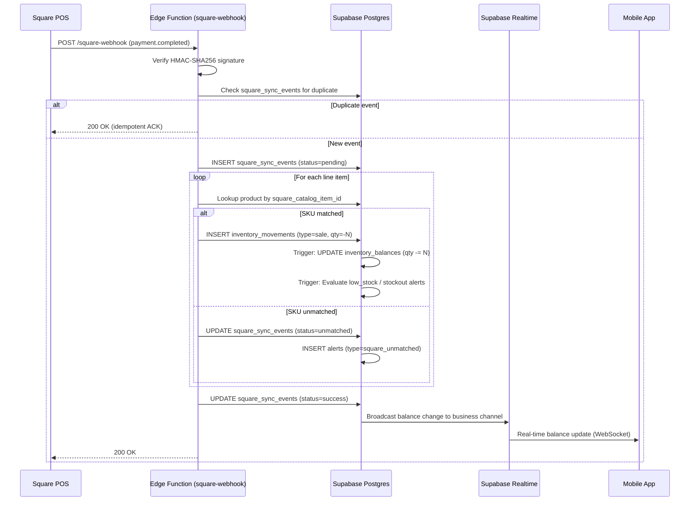
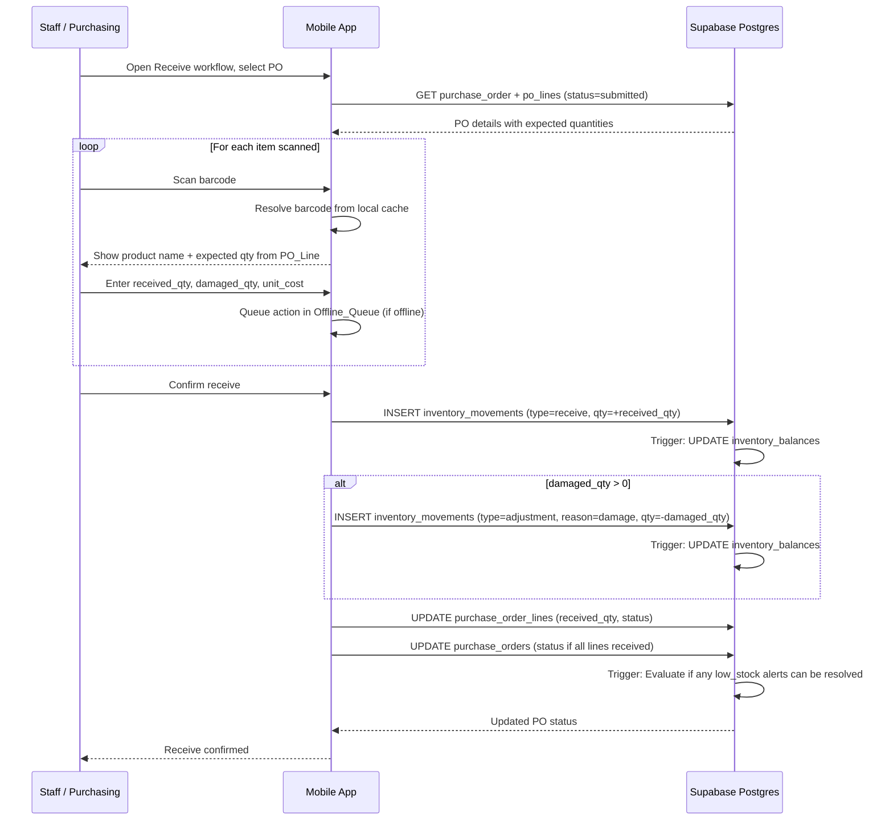
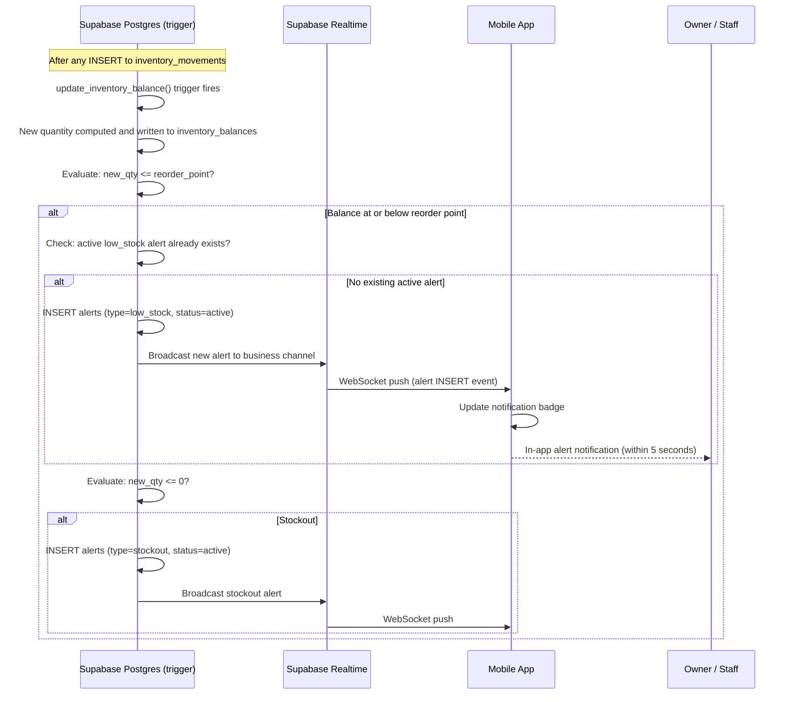
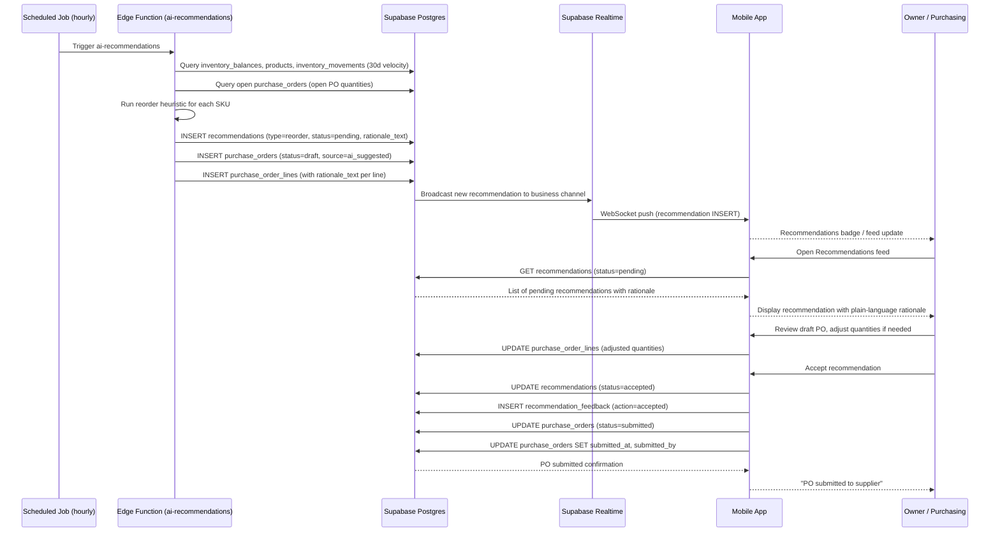

# Design Document: AI Inventory Manager

## Overview

The AI Inventory Manager is a mobile-first inventory and purchasing platform for micro retail businesses (convenience stores and similar). The system provides real-time inventory tracking, POS integration (Square), AI-driven purchase recommendations, and role-based access control — all backed by a Supabase platform (Postgres + Auth + Storage + Realtime + Edge Functions) and delivered via a React Native / Expo mobile application.

### Key Design Principles

- **Ledger-first**: All inventory quantity changes flow through an append-only movement ledger. Balances are derived values, never mutated directly.
- **Mobile-first**: The primary interface is a React Native / Expo application targeting iOS 15+ and Android 10+.
- **Supabase-native**: Prefer Postgres functions, RLS policies, and Edge Functions over external services. No separate API gateway is needed.
- **Multi-tenant ready**: All tables carry `business_id`. The MVP supports one store per business; the schema supports multi-location expansion without migration.
- **Heuristics-first AI**: MVP recommendations are rule-based and statistical (Z-score, sales velocity). No external ML service is required.
- **Security by default**: RLS enforces tenant and role isolation at the database layer. Square credentials never reach the mobile client.

---

## Architecture

### System Architecture Overview

```
┌──────────────────────────────────────────────────────┐
│                 Mobile Client (Expo)                  │
│  React Native + TypeScript                           │
│  Expo Router · react-hook-form · Zustand             │
│  NativeWind · expo-camera · react-native-mmkv        │
│  Supabase JS SDK (Auth, Realtime, Storage)           │
└─────────────────────┬────────────────────────────────┘
                       │ HTTPS (JWT)
                       │ Supabase Realtime (WebSocket)
                       ▼
┌──────────────────────────────────────────────────────┐
│              Supabase Platform                        │
│                                                      │
│  ┌────────────┐  ┌─────────────┐  ┌──────────────┐  │
│  │  Postgres  │  │    Auth     │  │   Storage    │  │
│  │  (RLS)     │  │  (JWT/RLS)  │  │  (S3-compat) │  │
│  └────────────┘  └─────────────┘  └──────────────┘  │
│                                                      │
│  ┌────────────┐  ┌─────────────────────────────────┐ │
│  │  Realtime  │  │       Edge Functions             │ │
│  │ (alerts,   │  │  square-webhook · square-sync   │ │
│  │  updates)  │  │  ai-recommendations · auth-hooks│ │
│  └────────────┘  └─────────────────────────────────┘ │
└─────────────────────┬────────────────────────────────┘
                       │ HTTPS (server-side only)
                       ▼
┌──────────────────────────────────────────────────────┐
│              Square Platform                          │
│  Webhooks → Edge Function endpoint                   │
│  Square Orders API / Catalog API / OAuth             │
└──────────────────────────────────────────────────────┘
```

The mobile client communicates exclusively with Supabase. All external API calls (Square) are proxied through Edge Functions. The mobile client never receives or stores Square credentials.

### Library Recommendations

| Concern | Library | Rationale |
|---|---|---|
| Barcode scanning | `expo-camera` + built-in barcode scanning | Managed workflow compatible; handles UPC-A/E, EAN, Code128, QR, Data Matrix natively since SDK 47 |
| Navigation | Expo Router (file-based) | First-class Expo integration, deep linking support |
| Forms | `react-hook-form` | Minimal re-renders, schema validation via `zod` |
| Offline queue / local cache | `react-native-mmkv` | ~30× faster than AsyncStorage; synchronous reads for catalog lookups |
| Server state / caching | TanStack Query v5 | Stale-while-revalidate, optimistic updates, background refetch |
| Client state | Zustand | Lightweight; manages auth state, offline queue state, UI state |
| UI components | NativeWind (Tailwind CSS for RN) | Utility-first; familiar to web developers; pairs well with Expo |
| Push notifications (arch only) | `expo-notifications` | Architected but not activated in MVP |

---

## Components and Interfaces

### Mobile Application Layer

```
src/
├── app/                         # Expo Router file-based routing
│   ├── (auth)/
│   │   ├── login.tsx
│   │   └── register.tsx
│   ├── (app)/
│   │   ├── _layout.tsx          # Authenticated layout with tab bar
│   │   ├── dashboard/
│   │   │   └── index.tsx
│   │   ├── inventory/
│   │   │   ├── index.tsx        # Stock on hand list
│   │   │   ├── [skuId].tsx      # Product detail / adjust
│   │   │   └── scan.tsx         # Barcode scanner
│   │   ├── receive/
│   │   │   ├── index.tsx        # PO selection / ad hoc
│   │   │   └── [poId].tsx       # Receive against PO
│   │   ├── count/
│   │   │   ├── index.tsx
│   │   │   └── [sessionId].tsx
│   │   ├── orders/
│   │   │   ├── index.tsx        # PO list
│   │   │   └── [poId].tsx
│   │   ├── recommendations/
│   │   │   └── index.tsx
│   │   └── reports/
│   │       └── index.tsx
├── components/                  # Shared UI components
├── stores/                      # Zustand stores
│   ├── authStore.ts
│   ├── offlineQueueStore.ts
│   └── syncStore.ts
├── hooks/                       # TanStack Query hooks
│   ├── useInventory.ts
│   ├── usePurchaseOrders.ts
│   └── useRecommendations.ts
├── lib/
│   ├── supabase.ts              # Supabase client singleton
│   ├── offlineQueue.ts          # MMKV-backed queue
│   └── idempotency.ts           # Client-side idempotency key generation
└── types/                       # Shared TypeScript types
```

### Supabase Edge Functions

| Function | Trigger | Responsibility |
|---|---|---|
| `square-webhook` | POST (Square webhook delivery) | Ingest, validate, idempotency check, create Movements |
| `square-reconcile` | Scheduled cron (every 60 min) | Poll Square Orders API for missed events |
| `square-catalog-sync` | Manual / scheduled | Sync Square catalog items to products table |
| `ai-recommendations` | Scheduled cron (hourly) | Run heuristics engine, write to recommendations table |
| `alert-engine` | Postgres trigger / scheduled | Evaluate alert rules after each Movement |
| `auth-hooks` | Supabase Auth hook | Inject business_id and role into JWT on sign-in |

### Key Interface Contracts

**Offline Queue Entry (MMKV)**
```typescript
interface OfflineAction {
  id: string;           // client-generated UUID (idempotency key)
  type: 'receive' | 'adjustment' | 'count_line' | 'sale_manual';
  payload: Record<string, unknown>;
  createdAt: string;    // ISO8601
  retryCount: number;
  status: 'pending' | 'syncing' | 'failed';
}
```

**Supabase Realtime Subscription (alerts channel)**
```typescript
supabase
  .channel(`alerts:business_id=eq.${businessId}`)
  .on('postgres_changes', {
    event: 'INSERT',
    schema: 'public',
    table: 'alerts',
    filter: `business_id=eq.${businessId}`,
  }, handleNewAlert)
  .subscribe();
```

---

## Data Models

### Full Postgres Schema

#### Core Tenant Tables

```sql
-- Tenant root
CREATE TABLE businesses (
  business_id     UUID PRIMARY KEY DEFAULT gen_random_uuid(),
  name            TEXT NOT NULL,
  timezone        TEXT NOT NULL DEFAULT 'UTC',
  currency        TEXT NOT NULL DEFAULT 'USD',
  created_at      TIMESTAMPTZ NOT NULL DEFAULT now(),
  updated_at      TIMESTAMPTZ NOT NULL DEFAULT now()
);

-- Physical locations (stores)
CREATE TABLE locations (
  location_id     UUID PRIMARY KEY DEFAULT gen_random_uuid(),
  business_id     UUID NOT NULL REFERENCES businesses(business_id),
  name            TEXT NOT NULL,
  address         TEXT,
  is_active       BOOLEAN NOT NULL DEFAULT true,
  created_at      TIMESTAMPTZ NOT NULL DEFAULT now()
);

-- Extends Supabase auth.users
CREATE TABLE user_profiles (
  user_id         UUID PRIMARY KEY REFERENCES auth.users(id) ON DELETE CASCADE,
  business_id     UUID NOT NULL REFERENCES businesses(business_id),
  display_name    TEXT,
  avatar_url      TEXT,
  created_at      TIMESTAMPTZ NOT NULL DEFAULT now()
);

-- Role per user per business
CREATE TABLE user_roles (
  user_role_id    UUID PRIMARY KEY DEFAULT gen_random_uuid(),
  user_id         UUID NOT NULL REFERENCES auth.users(id) ON DELETE CASCADE,
  business_id     UUID NOT NULL REFERENCES businesses(business_id),
  role            TEXT NOT NULL CHECK (role IN ('owner','staff','purchasing','accountant')),
  created_at      TIMESTAMPTZ NOT NULL DEFAULT now(),
  UNIQUE (user_id, business_id)
);
```

#### Product Catalog

```sql
CREATE TABLE suppliers (
  supplier_id         UUID PRIMARY KEY DEFAULT gen_random_uuid(),
  business_id         UUID NOT NULL REFERENCES businesses(business_id),
  name                TEXT NOT NULL,
  contact_name        TEXT,
  contact_email       TEXT,
  contact_phone       TEXT,
  lead_time_days      INTEGER NOT NULL DEFAULT 3,
  minimum_order_qty   NUMERIC(12,4) NOT NULL DEFAULT 1,
  notes               TEXT,
  is_active           BOOLEAN NOT NULL DEFAULT true,
  created_at          TIMESTAMPTZ NOT NULL DEFAULT now()
);

CREATE TABLE products (
  product_id          UUID PRIMARY KEY DEFAULT gen_random_uuid(),
  business_id         UUID NOT NULL REFERENCES businesses(business_id),
  sku                 TEXT NOT NULL,
  name                TEXT NOT NULL,
  description         TEXT,
  category            TEXT,
  unit_of_measure     TEXT NOT NULL DEFAULT 'each',
  default_supplier_id UUID REFERENCES suppliers(supplier_id),
  reorder_point       NUMERIC(12,4) NOT NULL DEFAULT 0,
  reorder_quantity    NUMERIC(12,4) NOT NULL DEFAULT 0,
  safety_stock        NUMERIC(12,4) NOT NULL DEFAULT 0,
  lead_time_days      INTEGER,            -- overrides supplier default
  cost_price          NUMERIC(12,4),      -- weighted average cost (recalculated on receive)
  selling_price       NUMERIC(12,4),
  image_storage_path  TEXT,               -- Supabase Storage path
  is_active           BOOLEAN NOT NULL DEFAULT true,
  created_at          TIMESTAMPTZ NOT NULL DEFAULT now(),
  updated_at          TIMESTAMPTZ NOT NULL DEFAULT now(),
  UNIQUE (business_id, sku)
);

CREATE TABLE product_barcodes (
  barcode_id      UUID PRIMARY KEY DEFAULT gen_random_uuid(),
  business_id     UUID NOT NULL REFERENCES businesses(business_id),
  product_id      UUID NOT NULL REFERENCES products(product_id),
  barcode_value   TEXT NOT NULL,
  barcode_type    TEXT,  -- UPC-A, EAN-13, Code128, QR, etc.
  is_primary      BOOLEAN NOT NULL DEFAULT false,
  created_at      TIMESTAMPTZ NOT NULL DEFAULT now(),
  UNIQUE (business_id, barcode_value)
);

CREATE TABLE product_variants (
  variant_id          UUID PRIMARY KEY DEFAULT gen_random_uuid(),
  product_id          UUID NOT NULL REFERENCES products(product_id),
  business_id         UUID NOT NULL REFERENCES businesses(business_id),
  sku                 TEXT NOT NULL,
  name                TEXT NOT NULL,        -- e.g. "6-pack", "case of 24"
  unit_multiplier     NUMERIC(12,4) NOT NULL DEFAULT 1,
  cost_price          NUMERIC(12,4),
  selling_price       NUMERIC(12,4),
  is_active           BOOLEAN NOT NULL DEFAULT true,
  created_at          TIMESTAMPTZ NOT NULL DEFAULT now(),
  UNIQUE (business_id, sku)
);
```

#### Inventory Ledger and Balances

```sql
-- Append-only ledger — NEVER UPDATE OR DELETE ROWS
CREATE TABLE inventory_movements (
  movement_id     UUID PRIMARY KEY DEFAULT gen_random_uuid(),
  business_id     UUID NOT NULL REFERENCES businesses(business_id),
  location_id     UUID NOT NULL REFERENCES locations(location_id),
  sku_id          UUID NOT NULL REFERENCES products(product_id),
  quantity_delta  NUMERIC(12,4) NOT NULL,  -- positive = inbound, negative = outbound
  movement_type   TEXT NOT NULL CHECK (movement_type IN (
                    'receive','sale','return','adjustment',
                    'count_correction','transfer')),
  reason_code     TEXT,  -- for adjustment/count_correction
  source          TEXT NOT NULL CHECK (source IN ('pos_square','manual','system')),
  reference_id    UUID,  -- square event id, PO id, count session id, etc.
  user_id         UUID REFERENCES auth.users(id),
  edge_fn_id      TEXT,  -- populated when source = 'system'
  notes           TEXT,
  before_quantity NUMERIC(12,4),  -- snapshot for adjustments
  after_quantity  NUMERIC(12,4),  -- snapshot for adjustments
  unit_cost       NUMERIC(12,4),  -- for receive movements
  created_at      TIMESTAMPTZ NOT NULL DEFAULT now()
);

-- Materialized balance — always equals SUM(quantity_delta) for the SKU/location
CREATE TABLE inventory_balances (
  balance_id      UUID PRIMARY KEY DEFAULT gen_random_uuid(),
  business_id     UUID NOT NULL REFERENCES businesses(business_id),
  location_id     UUID NOT NULL REFERENCES locations(location_id),
  sku_id          UUID NOT NULL REFERENCES products(product_id),
  quantity        NUMERIC(12,4) NOT NULL DEFAULT 0,
  updated_at      TIMESTAMPTZ NOT NULL DEFAULT now(),
  UNIQUE (business_id, location_id, sku_id)
);
```

#### Purchase Orders

```sql
CREATE TABLE purchase_orders (
  po_id               UUID PRIMARY KEY DEFAULT gen_random_uuid(),
  business_id         UUID NOT NULL REFERENCES businesses(business_id),
  location_id         UUID NOT NULL REFERENCES locations(location_id),
  supplier_id         UUID NOT NULL REFERENCES suppliers(supplier_id),
  status              TEXT NOT NULL DEFAULT 'draft'
                        CHECK (status IN ('draft','submitted','partially_received','received','cancelled')),
  source              TEXT NOT NULL DEFAULT 'manual'
                        CHECK (source IN ('manual','ai_suggested')),
  submitted_at        TIMESTAMPTZ,
  submitted_by        UUID REFERENCES auth.users(id),
  expected_delivery   DATE,
  notes               TEXT,
  attachment_paths    TEXT[],  -- Supabase Storage paths for receipt docs
  created_at          TIMESTAMPTZ NOT NULL DEFAULT now(),
  updated_at          TIMESTAMPTZ NOT NULL DEFAULT now()
);

CREATE TABLE purchase_order_lines (
  po_line_id          UUID PRIMARY KEY DEFAULT gen_random_uuid(),
  po_id               UUID NOT NULL REFERENCES purchase_orders(po_id),
  business_id         UUID NOT NULL REFERENCES businesses(business_id),
  sku_id              UUID NOT NULL REFERENCES products(product_id),
  ordered_quantity    NUMERIC(12,4) NOT NULL,
  received_quantity   NUMERIC(12,4) NOT NULL DEFAULT 0,
  unit_cost           NUMERIC(12,4),
  status              TEXT NOT NULL DEFAULT 'pending'
                        CHECK (status IN ('pending','partially_received','received')),
  rationale_text      TEXT,  -- AI-generated explanation (for ai_suggested POs)
  created_at          TIMESTAMPTZ NOT NULL DEFAULT now()
);
```

#### Stock Counts

```sql
CREATE TABLE stock_count_sessions (
  session_id      UUID PRIMARY KEY DEFAULT gen_random_uuid(),
  business_id     UUID NOT NULL REFERENCES businesses(business_id),
  location_id     UUID NOT NULL REFERENCES locations(location_id),
  count_type      TEXT NOT NULL CHECK (count_type IN ('cycle_count','full_audit')),
  status          TEXT NOT NULL DEFAULT 'in_progress'
                    CHECK (status IN ('in_progress','completed','cancelled')),
  started_by      UUID NOT NULL REFERENCES auth.users(id),
  started_at      TIMESTAMPTZ NOT NULL DEFAULT now(),
  completed_at    TIMESTAMPTZ,
  total_skus      INTEGER,
  total_variance  NUMERIC(12,4),
  variance_value  NUMERIC(12,4),
  created_at      TIMESTAMPTZ NOT NULL DEFAULT now()
);

CREATE TABLE stock_count_lines (
  count_line_id       UUID PRIMARY KEY DEFAULT gen_random_uuid(),
  session_id          UUID NOT NULL REFERENCES stock_count_sessions(session_id),
  business_id         UUID NOT NULL REFERENCES businesses(business_id),
  sku_id              UUID NOT NULL REFERENCES products(product_id),
  snapshot_quantity   NUMERIC(12,4) NOT NULL,  -- balance at session start
  counted_quantity    NUMERIC(12,4),
  variance            NUMERIC(12,4),           -- counted - snapshot
  movement_id         UUID REFERENCES inventory_movements(movement_id),
  scanned_at          TIMESTAMPTZ,
  submitted_at        TIMESTAMPTZ,
  created_at          TIMESTAMPTZ NOT NULL DEFAULT now()
);
```

#### Alerts

```sql
CREATE TABLE alerts (
  alert_id        UUID PRIMARY KEY DEFAULT gen_random_uuid(),
  business_id     UUID NOT NULL REFERENCES businesses(business_id),
  location_id     UUID NOT NULL REFERENCES locations(location_id),
  sku_id          UUID REFERENCES products(product_id),
  alert_type      TEXT NOT NULL CHECK (alert_type IN ('low_stock','stockout','anomaly','square_unmatched')),
  status          TEXT NOT NULL DEFAULT 'active'
                    CHECK (status IN ('active','acknowledged','resolved')),
  acknowledged_by UUID REFERENCES auth.users(id),
  acknowledged_at TIMESTAMPTZ,
  resolved_at     TIMESTAMPTZ,
  message         TEXT,
  created_at      TIMESTAMPTZ NOT NULL DEFAULT now()
);
```

#### Square Integration

```sql
CREATE TABLE square_sync_events (
  event_id            UUID PRIMARY KEY DEFAULT gen_random_uuid(),
  business_id         UUID NOT NULL REFERENCES businesses(business_id),
  square_event_type   TEXT NOT NULL,
  square_event_id     TEXT NOT NULL,
  payload             JSONB,
  status              TEXT NOT NULL DEFAULT 'pending'
                        CHECK (status IN ('pending','success','failed','unmatched','duplicate')),
  retry_count         INTEGER NOT NULL DEFAULT 0,
  processed_at        TIMESTAMPTZ,
  error_message       TEXT,
  created_at          TIMESTAMPTZ NOT NULL DEFAULT now(),
  UNIQUE (square_event_id)
);
```

#### AI Recommendations

```sql
CREATE TABLE recommendations (
  recommendation_id   UUID PRIMARY KEY DEFAULT gen_random_uuid(),
  business_id         UUID NOT NULL REFERENCES businesses(business_id),
  recommendation_type TEXT NOT NULL CHECK (recommendation_type IN ('reorder','dead_stock','count_priority','anomaly')),
  sku_id              UUID REFERENCES products(product_id),
  rationale_text      TEXT NOT NULL,
  confidence_level    TEXT NOT NULL CHECK (confidence_level IN ('heuristic','forecast')),
  status              TEXT NOT NULL DEFAULT 'pending'
                        CHECK (status IN ('pending','accepted','rejected','expired')),
  suggested_quantity  NUMERIC(12,4),
  created_at          TIMESTAMPTZ NOT NULL DEFAULT now(),
  expires_at          TIMESTAMPTZ NOT NULL DEFAULT (now() + INTERVAL '30 days')
);

CREATE TABLE recommendation_feedback (
  feedback_id         UUID PRIMARY KEY DEFAULT gen_random_uuid(),
  recommendation_id   UUID NOT NULL REFERENCES recommendations(recommendation_id),
  business_id         UUID NOT NULL REFERENCES businesses(business_id),
  user_id             UUID NOT NULL REFERENCES auth.users(id),
  action              TEXT NOT NULL CHECK (action IN ('accepted','rejected','modified')),
  rejection_reason    TEXT CHECK (rejection_reason IN ('already_ordered','not_needed','wrong_quantity','other')),
  notes               TEXT,
  created_at          TIMESTAMPTZ NOT NULL DEFAULT now()
);
```

#### Supporting Tables

```sql
-- Log of all offline actions processed server-side (for idempotency)
CREATE TABLE offline_queue_log (
  log_id              UUID PRIMARY KEY DEFAULT gen_random_uuid(),
  business_id         UUID NOT NULL REFERENCES businesses(business_id),
  idempotency_key     TEXT NOT NULL,
  action_type         TEXT NOT NULL,
  payload             JSONB,
  status              TEXT NOT NULL CHECK (status IN ('processed','failed','conflict')),
  conflict_details    JSONB,
  processed_at        TIMESTAMPTZ NOT NULL DEFAULT now(),
  UNIQUE (idempotency_key)
);
```

### Indexes

```sql
-- Ledger queries (balance computation, history, reports)
CREATE INDEX idx_movements_sku_location
  ON inventory_movements (business_id, sku_id, location_id, created_at DESC);

CREATE INDEX idx_movements_reference
  ON inventory_movements (reference_id);

CREATE INDEX idx_movements_type_source
  ON inventory_movements (business_id, movement_type, source, created_at DESC);

-- PO lookups
CREATE INDEX idx_po_status
  ON purchase_orders (business_id, status);

-- Alert lookups
CREATE INDEX idx_alerts_active
  ON alerts (business_id, status, sku_id);

-- Square idempotency
CREATE UNIQUE INDEX idx_square_event_id
  ON square_sync_events (square_event_id);

-- Barcode resolution (critical path — must be fast)
CREATE INDEX idx_barcodes_lookup
  ON product_barcodes (business_id, barcode_value);

-- Recommendation feed
CREATE INDEX idx_recommendations_pending
  ON recommendations (business_id, status, created_at DESC);
```

### Postgres Consistency Function

```sql
-- Computes balance from ledger — must always equal inventory_balances.quantity
CREATE OR REPLACE FUNCTION get_inventory_balance(p_sku_id UUID, p_location_id UUID)
RETURNS NUMERIC AS $$
  SELECT COALESCE(SUM(quantity_delta), 0)
  FROM inventory_movements
  WHERE sku_id = p_sku_id
    AND location_id = p_location_id;
$$ LANGUAGE sql STABLE SECURITY DEFINER;
```

---

## Security Model

### RLS Tenant Isolation Strategy

Every table containing business data has a `business_id` column. RLS policies enforce that all row access is gated by the authenticated user's `business_id` JWT claim.

**JWT Claim Injection (Auth Hook)**

The `auth-hooks` Edge Function is registered as a Supabase Auth `custom_access_token` hook. On each sign-in it queries `user_roles` and injects `business_id` and `role` into the JWT payload.

```sql
-- Example RLS policy (applied to all business tables)
ALTER TABLE inventory_movements ENABLE ROW LEVEL SECURITY;

CREATE POLICY "tenant_isolation" ON inventory_movements
  FOR ALL
  USING (business_id = (auth.jwt() ->> 'business_id')::uuid);
```

### Role-Based Row Access

For tables where role-level restrictions apply beyond tenant isolation, additional policies layer on top:

```sql
-- Only owner and purchasing can INSERT into purchase_orders
CREATE POLICY "po_insert_roles" ON purchase_orders
  FOR INSERT
  WITH CHECK (
    business_id = (auth.jwt() ->> 'business_id')::uuid
    AND (auth.jwt() ->> 'role') IN ('owner', 'purchasing')
  );

-- Accountants and above can SELECT reports (inventory_movements)
CREATE POLICY "movement_read_roles" ON inventory_movements
  FOR SELECT
  USING (
    business_id = (auth.jwt() ->> 'business_id')::uuid
    AND (auth.jwt() ->> 'role') IN ('owner', 'purchasing', 'staff', 'accountant')
  );
```

### Append-Only Ledger Enforcement

A Postgres trigger prevents UPDATE and DELETE on `inventory_movements`:

```sql
CREATE OR REPLACE FUNCTION prevent_movement_mutation()
RETURNS TRIGGER AS $$
BEGIN
  RAISE EXCEPTION 'inventory_movements is append-only; mutations are not permitted';
END;
$$ LANGUAGE plpgsql;

CREATE TRIGGER no_movement_update
  BEFORE UPDATE OR DELETE ON inventory_movements
  FOR EACH ROW EXECUTE FUNCTION prevent_movement_mutation();
```

RLS further blocks direct writes:

```sql
-- No UPDATE or DELETE allowed via RLS (complement to trigger)
CREATE POLICY "movements_no_update" ON inventory_movements
  FOR UPDATE USING (false);

CREATE POLICY "movements_no_delete" ON inventory_movements
  FOR DELETE USING (false);
```

### Edge Function Authentication

All Edge Functions validate the incoming JWT before processing:

```typescript
// Standard auth guard for Edge Functions
const authHeader = req.headers.get('Authorization');
const { data: { user }, error } = await supabase.auth.getUser(
  authHeader?.replace('Bearer ', '') ?? ''
);
if (error || !user) {
  return new Response(JSON.stringify({ error: 'Unauthorized' }), { status: 401 });
}
```

Square webhooks use a separate signature verification path (HMAC-SHA256 against the Square webhook signature key stored in Supabase Vault / environment secrets). The mobile client is never involved in Square API calls.

### Secret Management

| Secret | Storage | Access |
|---|---|---|
| Square OAuth tokens | Supabase Vault (encrypted) | `square-webhook` and `square-reconcile` Edge Functions only |
| Square webhook signature key | Supabase Edge Function environment variable | `square-webhook` only |
| Supabase service role key | Supabase Edge Function environment variable | Edge Functions only |
| Supabase anon key | Mobile client (public, safe) | Client SDK — restricted by RLS |

---

## Inventory Ledger Design

### Core Invariant

For every SKU at every location:

```
SUM(quantity_delta) over all inventory_movements
  WHERE sku_id = X AND location_id = Y
= inventory_balances.quantity
  WHERE sku_id = X AND location_id = Y
```

This invariant is maintained by the `update_inventory_balance` trigger, which fires AFTER INSERT on `inventory_movements` and updates the corresponding row in `inventory_balances` atomically within the same transaction.

```sql
CREATE OR REPLACE FUNCTION update_inventory_balance()
RETURNS TRIGGER AS $$
BEGIN
  INSERT INTO inventory_balances (business_id, location_id, sku_id, quantity, updated_at)
  VALUES (NEW.business_id, NEW.location_id, NEW.sku_id, NEW.quantity_delta, now())
  ON CONFLICT (business_id, location_id, sku_id)
  DO UPDATE SET
    quantity   = inventory_balances.quantity + NEW.quantity_delta,
    updated_at = now();

  RETURN NEW;
END;
$$ LANGUAGE plpgsql;

CREATE TRIGGER trg_update_balance
  AFTER INSERT ON inventory_movements
  FOR EACH ROW EXECUTE FUNCTION update_inventory_balance();
```

### Weighted Average Cost Update

When a receive movement is inserted, the trigger also recalculates `products.cost_price`:

```
new_wac = (current_balance * current_cost + received_qty * unit_cost)
          / (current_balance + received_qty)
```

### Correction Pattern

Erroneous movements are never modified. A correction creates an equal and opposite movement:

```
Original:  movement_id=A, quantity_delta=-50, movement_type='sale'   (error)
Offset:    movement_id=B, quantity_delta=+50, movement_type='adjustment',
           reason_code='counting_correction', reference_id=A
```

The net effect on the ledger is zero for the error, and the audit trail is complete.

### Alert Trigger After Balance Update

The balance update trigger also evaluates alert conditions:

```sql
-- After balance update, check alert conditions
IF (new_balance.quantity <= product.reorder_point) THEN
  -- Insert low_stock alert if no active alert exists
END IF;

IF (new_balance.quantity <= 0) THEN
  -- Insert stockout alert
END IF;
```

---

## Square Integration Architecture

### Webhook Ingestion Flow

```
Square → POST /functions/v1/square-webhook
  │
  ├─ 1. Verify HMAC-SHA256 signature (reject 401 if invalid)
  ├─ 2. Check square_sync_events for duplicate square_event_id
  │       └─ Duplicate? → return 200 (idempotent ACK), mark status='duplicate'
  ├─ 3. Insert square_sync_events row (status='pending')
  ├─ 4. Dispatch to event handler by event_type
  │       ├─ payment.completed / order.fulfilled → create sale Movements
  │       ├─ refund.created / payment.refunded   → create return Movements
  │       └─ order.cancelled / payment.voided    → create offsetting Movements
  ├─ 5. On success: update status='success', processed_at=now()
  └─ 6. On error: increment retry_count
            └─ retry_count >= 3? → status='failed' (dead-letter)
```

### Retry with Exponential Backoff

Retries are managed by a scheduled Edge Function (`square-webhook-retry`) that runs every 5 minutes and processes failed events:

```
attempt 1: immediate
attempt 2: +30 seconds
attempt 3: +2 minutes
attempt 4: mark as dead-letter (status='failed')
```

Failed events are surfaced in the admin view. Operators can manually re-trigger processing or mark as resolved.

### Polling Reconciliation Fallback

The `square-reconcile` function runs every 60 minutes. If the last successful webhook event for a business is older than 60 minutes and the Square API is reachable, it:

1. Queries Square Orders API for orders updated since the last successful sync timestamp
2. Compares against `square_sync_events` to identify any missed `payment.completed` events
3. Synthesizes and processes the missing events as if they had arrived via webhook

### Catalog Sync

The `square-catalog-sync` Edge Function maps Square catalog items to `products` and `product_barcodes`:

- Square `catalog_item_id` is stored in `products.sku` (or a dedicated column for the mapping)
- Square item variation IDs map to `product_variants`
- Barcode/UPC from Square item data populates `product_barcodes`
- Run on initial connection and on Square catalog update webhooks

### Security Constraints

- Square OAuth tokens stored exclusively in Supabase Vault, read only within Edge Functions
- Mobile client uses Supabase anon key + RLS; never touches Square API directly
- Edge Functions use service role key for privileged DB writes, but only after verifying webhook signature or validating user JWT

---

## AI Recommendation Architecture

### Heuristics-First MVP Design

All AI logic runs inside the `ai-recommendations` Edge Function on a scheduled basis (hourly). No external ML service is called. All computations are performed via Postgres queries and in-function arithmetic.

### Recommendation Types and Algorithms

#### 1. Reorder Recommendations

**Inputs per SKU:**
- `current_balance` from `inventory_balances`
- `reorder_point`, `safety_stock`, `lead_time_days` from `products`
- `sales_velocity_30d` = SUM(ABS(quantity_delta)) for sale movements in last 30 days / 30
- `open_po_qty` = SUM(ordered_quantity - received_quantity) for submitted POs

**Logic:**

```
projected_balance_at_arrival = current_balance + open_po_qty
                               - (sales_velocity_30d * lead_time_days)

IF projected_balance_at_arrival <= reorder_point THEN
  suggested_qty = (sales_velocity_30d * 28) + safety_stock - current_balance - open_po_qty
  suggested_qty = MAX(suggested_qty, supplier.minimum_order_qty)
  suggested_qty = CEIL(suggested_qty / case_pack_size) * case_pack_size  -- case rounding
  confidence_level = 'heuristic'
END
```

**Rationale template:**
> "Sales velocity: {vel:.1f} units/day. Current stock: {balance} units. Lead time: {lt} days. Open PO: {open_po} units. Projected stock at delivery: {projected} units (below reorder point of {rp}). Recommended order: {qty} units to cover 4 weeks with safety buffer."

#### 2. Dead Stock Detection

```
IF days_since_last_sale >= 60 AND current_balance > 0 THEN
  flag as dead_stock recommendation
  confidence_level = 'heuristic'
```

`days_since_last_sale` = days since most recent `movement_type='sale'` in ledger for this SKU.

#### 3. Count Priority

```
shrinkage_30d = ABS(SUM(quantity_delta)) for adjustment movements
                WHERE reason_code IN ('theft','spoilage','damage')
                AND created_at >= now() - INTERVAL '30 days'

received_30d  = SUM(quantity_delta) for receive movements in last 30 days

IF received_30d > 0 AND (shrinkage_30d / received_30d) > 0.10 THEN
  flag as count_priority recommendation
```

#### 4. Anomaly Detection (Z-score)

```
velocity_90d_daily = [ daily_sale_total for each day in last 90 days ]
mean_90d  = AVG(velocity_90d_daily)
stddev_90d = STDDEV(velocity_90d_daily)
velocity_7d = AVG(daily_sale_total for last 7 days)

z_score = (velocity_7d - mean_90d) / stddev_90d

IF z_score > 3.0 THEN flag anomaly (unusual sales surge)
IF z_score < -3.0 THEN flag anomaly (unusual sales drought / possible data issue)
```

### Feedback Loop

User feedback (accept/reject/modify) is stored in `recommendation_feedback`. The `ai-recommendations` function reads the rejection ratio per SKU before generating new recommendations:

- If a SKU has been rejected with `not_needed` or `already_ordered` in the last 7 days, suppress new reorder recommendations for it
- Accepted recommendations that resulted in POs are used to validate velocity assumptions (Phase 2 tuning)

### Recommendation Lifecycle

```
created (status=pending)
  ├─ User accepts  → status=accepted → creates draft PO (reorder type)
  ├─ User rejects  → status=rejected → feedback recorded
  ├─ 30 days pass  → status=expired  (scheduled job)
  └─ New recommendation supersedes → old one marked expired
```

---

## Offline Strategy

### Architecture

The offline layer uses `react-native-mmkv` as the local store (synchronous reads, ~30× faster than AsyncStorage). The Zustand `offlineQueueStore` manages the queue state in memory, backed by MMKV for persistence across app restarts.

### Offline-Capable Workflows

| Workflow | Offline behavior | Conflict resolution |
|---|---|---|
| Barcode scan + lookup | Resolved against local product catalog cache | Cache refreshed at startup and on reconnect |
| Stock receive | Queued in Offline_Queue | Last-write-wins on PO_Line received_qty; conflicts flagged if PO_Line modified by another user |
| Stock count | Queued in Offline_Queue | Ledger append; count_correction movements applied in chronological order |
| Manual adjustment | Queued in Offline_Queue | Ledger append |
| Dashboard / reports | Show stale data with "offline" banner | Fresh data loaded on reconnect |

### Idempotency Keys

Each action generates a UUID at queue time (client-side):

```typescript
const idempotencyKey = `${deviceId}:${actionType}:${Date.now()}:${randomUUID()}`;
```

The server-side endpoint checks `offline_queue_log` for the key before processing. Duplicate keys return 200 with the original result (idempotent response).

### Sync-on-Reconnect Flow

```
NetInfo listener detects isConnected = true
  │
  ├─ 1. Show sync progress banner in UI
  ├─ 2. Dequeue actions in chronological order (FIFO)
  ├─ 3. For each action:
  │       ├─ POST to Edge Function with idempotency key
  │       ├─ On success: remove from queue, update optimistic UI
  │       ├─ On conflict: flag for user review, keep in queue
  │       └─ On server error: increment retry count
  ├─ 4. After queue empty: refresh product catalog cache
  └─ 5. Dismiss sync banner
```

### Product Catalog Cache

At app startup and on reconnect, the app syncs the product catalog to MMKV:

```typescript
// Cached product entry
interface CachedProduct {
  product_id: string;
  sku: string;
  name: string;
  barcodes: string[];
  balance: number;
  balanceSyncedAt: string;  // ISO8601 — shown as "balance as of X" when offline
}
```

---

## Sequence Diagrams

### 1. Completed Square Sale → Inventory Decrement



### 2. Receiving Stock Against a Purchase Order



### 3. Low-Stock Detection and Alert Creation



### 4. AI-Generated PO Recommendation → Review → Approval → PO Creation



---

## Correctness Properties

*A property is a characteristic or behavior that should hold true across all valid executions of a system — essentially, a formal statement about what the system should do. Properties serve as the bridge between human-readable specifications and machine-verifiable correctness guarantees.*

The following properties are derived from the acceptance criteria in the requirements document. Each is a universally quantified statement suitable for property-based testing.

**Property reflection notes**: Properties 1 and 2 consolidate the multiple ledger-consistency criteria (1.1, 1.2, 1.3, 1.6, 1.7). Properties 7 and 8 consolidate alert creation for low_stock and stockout (4.1, 4.5). Property 5 consolidates refund and void movements (3.4, 3.5). Property 4 consolidates sale idempotency (3.2).

---

### Property 1: Movement Field Completeness

*For any* inventory movement created by any workflow (receive, sale, adjustment, count_correction, return), the resulting `inventory_movements` row SHALL contain non-null values for `movement_id`, `business_id`, `location_id`, `sku_id`, `quantity_delta`, `movement_type`, `source`, and either `user_id` (for user-initiated actions) or `edge_fn_id` (for system-initiated actions), and `created_at`.

**Validates: Requirements 1.1, 1.6**

---

### Property 2: Ledger-Balance Consistency Invariant

*For any* SKU at any location, after any sequence of movement inserts (of any type, in any order), the value stored in `inventory_balances.quantity` for that SKU-location pair SHALL equal the arithmetic sum of all `quantity_delta` values in `inventory_movements` for that same SKU-location pair.

**Validates: Requirements 1.2, 1.3, 1.7**

---

### Property 3: Receive Creates Valid Movement

*For any* receive transaction (PO-linked or ad hoc) with a positive `received_quantity` and optionally a `damaged_quantity`, the system SHALL create exactly one `receive` movement with `quantity_delta = received_quantity`, and, if `damaged_quantity > 0`, exactly one additional `adjustment` movement with `reason_code = 'damage'` and `quantity_delta = -damaged_quantity`. The sum of these movements applied to `inventory_balances` must reflect only the non-damaged quantity.

**Validates: Requirements 2.3, 2.5**

---

### Property 4: Square Webhook Idempotency

*For any* Square event with a given `square_event_id`, processing that event payload two or more times SHALL produce the same number of `inventory_movements` rows as processing it exactly once. Subsequent invocations with the same `square_event_id` SHALL be recorded as `status = 'duplicate'` in `square_sync_events` and SHALL NOT create additional movement rows.

**Validates: Requirements 3.2**

---

### Property 5: Offsetting Movements for Refunds and Voids

*For any* Square refund or void event referencing an original `payment.completed` event, the system SHALL create a movement with a `quantity_delta` that exactly offsets the original sale movement(s) for each affected SKU, and the resulting `inventory_balances` for those SKUs SHALL equal the balances that existed before the original sale was processed.

**Validates: Requirements 3.4, 3.5**

---

### Property 6: Square Webhook Retry Bound

*For any* Square webhook event that fails processing due to a transient error, the system SHALL retry the event at most 3 times. After 3 failed attempts the event status SHALL be `'failed'`; the total number of processing attempts SHALL never exceed 4.

**Validates: Requirements 3.7**

---

### Property 7: Alert Creation at Reorder Threshold

*For any* SKU at any location, when a movement causes `inventory_balances.quantity` to fall at or below `products.reorder_point`, the system SHALL ensure exactly one `active` alert of type `low_stock` exists for that SKU-location pair. If the balance reaches zero or below, the system SHALL additionally ensure exactly one `active` alert of type `stockout` exists. No duplicate active alerts of the same type for the same SKU-location pair SHALL exist.

**Validates: Requirements 4.1, 4.2, 4.5**

---

### Property 8: Alert Auto-Resolution on Restock

*For any* SKU at any location with an `active` `low_stock` alert, when a receive movement causes `inventory_balances.quantity` to rise strictly above `products.reorder_point`, that alert SHALL be transitioned to `resolved` status. The alert record SHALL NOT be deleted.

**Validates: Requirements 4.7, 4.8**

---

### Property 9: Adjustment Reason Code and Snapshot Completeness

*For any* stock adjustment submitted through the system, the resulting `inventory_movements` row SHALL contain a non-null `reason_code` from the allowed set (`damage`, `spoilage`, `theft`, `counting_correction`, `supplier_shortage`, `internal_use`, `transfer_correction`, `other`), a non-null `before_quantity` snapshot, and a non-null `after_quantity` snapshot, where `after_quantity = before_quantity + quantity_delta`.

**Validates: Requirements 5.1, 5.3, 5.4**

---

### Property 10: Approval Threshold Enforcement

*For any* adjustment submitted by a Staff user where `ABS(quantity_delta)` exceeds the business-configured approval threshold, the adjustment status SHALL be `pending_approval` and the `inventory_balances.quantity` for the affected SKU SHALL remain unchanged until an Owner explicitly approves the adjustment.

**Validates: Requirements 5.5, 5.6, 5.7**

---

### Property 11: Count Session Variance Correctness

*For any* stock count session, for any SKU count line where the user submits a `counted_quantity`, the `variance` field SHALL equal `counted_quantity - snapshot_quantity`, and if the variance is non-zero, exactly one `count_correction` movement SHALL be created with `quantity_delta = variance`. The updated `inventory_balances.quantity` for that SKU SHALL equal `snapshot_quantity + variance = counted_quantity`.

**Validates: Requirements 6.4, 6.5**

---

### Property 12: Barcode Resolution Uniqueness

*For any* barcode value registered to a business, resolving that barcode SHALL return exactly one product. *For any* attempt to register the same barcode value to a different product within the same business, the system SHALL reject the registration with a conflict error.

**Validates: Requirements 7.2, 7.5**

---

### Property 13: Variant Multiplier Expansion

*For any* product variant with `unit_multiplier = M`, scanning its barcode during a receive workflow and entering a quantity `N` SHALL create a movement with `quantity_delta = N * M`. The resulting balance increment SHALL equal `N * M` units.

**Validates: Requirements 7.7**

---

### Property 14: PO State Machine Validity

*For any* purchase order, all status transitions SHALL be restricted to the valid set: `draft → submitted`, `submitted → partially_received`, `partially_received → received`, `submitted → partially_received → received`, `draft → cancelled`, `submitted → cancelled`. Any attempt to apply an invalid transition SHALL be rejected.

**Validates: Requirements 8.1**

---

### Property 15: AI-Suggested PO Rationale Completeness

*For any* purchase order created with `source = 'ai_suggested'`, every `purchase_order_lines` row for that PO SHALL have a non-empty `rationale_text` that references at minimum: the SKU's current balance, the calculated sales velocity, the lead time, and the recommended quantity.

**Validates: Requirements 8.5, 8.6**

---

### Property 16: Reorder Quantity Calculation Correctness

*For any* SKU with known inputs (`current_balance`, `reorder_point`, `safety_stock`, `lead_time_days`, `sales_velocity_30d`, `open_po_qty`, `supplier_moq`), the AI-suggested reorder quantity SHALL satisfy: `suggested_qty >= supplier_moq`, `suggested_qty >= 0`, and the projected balance at arrival (`current_balance + open_po_qty + suggested_qty - sales_velocity_30d * lead_time_days`) SHALL be greater than `reorder_point + safety_stock`.

**Validates: Requirements 11.6**

---

### Property 17: Dead Stock Detection Completeness

*For any* SKU where (a) the most recent `movement_type = 'sale'` in `inventory_movements` was more than 60 days ago AND (b) `inventory_balances.quantity > 0`, the `recommendations` table SHALL contain at least one non-expired recommendation of `recommendation_type = 'dead_stock'` for that SKU.

**Validates: Requirements 11.7**

---

### Property 18: Anomaly Detection Z-Score Property

*For any* SKU where the average daily sales velocity over the last 7 days deviates more than 3 standard deviations from the 90-day mean daily velocity (computed from Ledger sale movements), the `recommendations` table SHALL contain a non-expired recommendation of `recommendation_type = 'anomaly'` for that SKU.

**Validates: Requirements 11.8**

---

### Property 19: Tenant Isolation via RLS

*For any* authenticated request carrying a JWT with `business_id = X`, no query against any business-data table SHALL return rows where `business_id != X`. This holds regardless of query parameters, filters, or join conditions supplied by the caller.

**Validates: Requirements 12.3, 9.4**

---

### Property 20: Offline Queue Idempotency

*For any* offline action that has been successfully synced to the server (i.e., recorded in `offline_queue_log` with `status = 'processed'`), submitting the same action again with the same `idempotency_key` SHALL NOT create additional `inventory_movements` rows. The server SHALL respond with the original success response.

**Validates: Requirements 13.7**

---

## Error Handling

### Client-Side Error Handling

All errors are caught at the TanStack Query / Zustand layer and routed through a central `useErrorHandler` hook that:
1. Strips any internal error details before display
2. Maps Supabase error codes to user-friendly messages
3. Logs structured error events to Supabase audit log

| Error Category | User-Facing Message | Technical Action |
|---|---|---|
| 401 Unauthorized / expired JWT | "Your session has expired. Please sign in again." | Clear local tokens, navigate to login |
| 403 Forbidden (RLS violation) | "You don't have permission to do that." | Log permission-denied event |
| Network timeout | "No connection. Your action has been saved and will sync when you're back online." | Enqueue to Offline_Queue |
| Barcode not found | "Product not found. Would you like to add it?" | Navigate to product creation |
| Duplicate barcode conflict | "This barcode is already assigned to [Product Name]." | Show conflict detail |
| PO state transition invalid | "This order can't be changed in its current status." | Show current status |
| Square webhook unmatched SKU | (not shown to end user) | Insert unmatched alert for Owner |

### Server-Side Error Handling

Edge Functions return structured error responses:

```typescript
// Standard error shape
{ "error": "human-readable message", "code": "ERR_CODE", "details": null }
```

Stack traces, SQL errors, and internal identifiers are never included in responses to clients. All errors are logged to the Supabase audit log with full context for operator review.

### Ledger Write Failure

If the `inventory_movements` INSERT fails for any reason (constraint violation, timeout), the database transaction is rolled back atomically. The `inventory_balances` row is never updated without a corresponding `inventory_movements` entry. The caller receives a 500 error and should retry (for Edge Functions) or queue offline (for the mobile client).

---

## Testing Strategy

### Overview

Testing for this system uses a dual approach:
- **Unit / property-based tests**: Jest + `fast-check` for TypeScript business logic, Postgres functions, and AI heuristics
- **Integration tests**: Supabase local dev stack (`supabase start`) for RLS policies, triggers, and Edge Function behavior
- **End-to-end tests**: Maestro for critical mobile flows on iOS/Android simulators

### Property-Based Testing

The 20 correctness properties above map directly to property-based tests using `fast-check` in Jest.

**Configuration:**
- Minimum 100 iterations per property test (fast-check default `numRuns: 100`)
- Seed-based reproduction for CI failures
- Tag format in test files: `// Feature: ai-inventory-manager, Property N: <property_text>`

**Library**: `fast-check` (TypeScript-native, works with Jest, no extra setup in Expo/Node environment)

**Example property test structure:**

```typescript
import fc from 'fast-check';

// Feature: ai-inventory-manager, Property 2: Ledger-Balance Consistency Invariant
test('ledger balance consistency invariant', () => {
  fc.assert(
    fc.property(
      fc.array(fc.record({
        quantity_delta: fc.float({ noNaN: true, noDefaultInfinity: true }),
        movement_type: fc.constantFrom('receive', 'sale', 'adjustment'),
      }), { minLength: 1, maxLength: 50 }),
      (movements) => {
        const ledgerSum = movements.reduce((sum, m) => sum + m.quantity_delta, 0);
        const { balance } = applyMovementsToBalance(movements);
        expect(balance).toBeCloseTo(ledgerSum, 4);
      }
    ),
    { numRuns: 100 }
  );
});
```

### RLS Policy Validation Tests

RLS policies are tested using the Supabase local stack with two business fixtures (A and B) and all four roles:

```typescript
// For each table and each role, verify:
// 1. User from business A cannot see business B's rows
// 2. User with insufficient role is rejected for write operations
describe('RLS: inventory_movements tenant isolation', () => {
  it('business A user cannot read business B movements', async () => {
    const { data, error } = await supabaseAsBusinessA
      .from('inventory_movements')
      .select()
      .eq('business_id', businessBId);
    expect(data).toHaveLength(0);  // RLS returns empty, not error
  });
});
```

### Unit Tests

Unit tests (Jest, no fast-check) cover:
- Specific workflow examples (receive a PO, create a PO, submit an adjustment)
- Edge cases: empty barcode, zero quantity, cancelled PO transitions
- Error conditions: duplicate barcode assignment, invalid role transitions
- AI heuristic calculations with known input/output pairs

**Test-to-property ratio**: For every property test, write 1–2 unit tests for specific edge cases that the generator might not reliably produce (e.g., `quantity_delta = 0`, `sales_velocity = 0`, `lead_time = 0`).

### Integration Tests

Integration tests run against `supabase start` (local Postgres):
- Trigger behavior: `update_inventory_balance` fires on movement insert
- Alert trigger: `low_stock` alert created when balance falls below reorder point
- Append-only enforcement: UPDATE/DELETE on `inventory_movements` returns error
- Square webhook Edge Function: mock Square payloads, verify movement creation
- `get_inventory_balance()` function matches materialized balance

### Deployment Environments

| Environment | Supabase Project | Purpose |
|---|---|---|
| Local dev | `supabase start` (Docker) | Developer sandbox, full stack locally |
| Staging | Dedicated Supabase project | Pre-production testing, Square sandbox credentials |
| Production | Dedicated Supabase project | Live; Square production credentials in Vault |

**Migration strategy**: Supabase CLI versioned migration files (`supabase/migrations/`). Each migration is named with a timestamp prefix and is idempotent. Migrations are applied via `supabase db push` in CI/CD (GitHub Actions).

**Seed data**: `supabase/seed.sql` contains a sample convenience-store catalog with 20+ SKUs, 2 suppliers, 1 sample PO, and 30 days of ledger movements for development and QA use.

**Environment promotion**: local → staging → production. No direct production deployments. Staging is kept in sync with production schema at all times.

---
